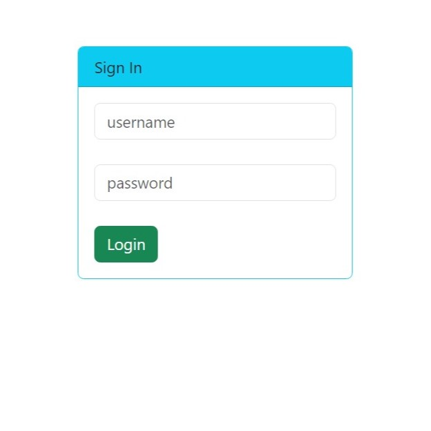

# THIS README FILE IS STILL UNDER THE DEVELOPMENT. 

**[SEE TODO LIST](#todo-list)**

<hr>

# MyGolfClub

MyGolfClub is an implementation of a web-based management system.
Users must log in using **unique** username and respected password to **authenticate**.
All passwords are **encrypted** using **bcrypt** and stored securely in a database.
Each user is associated with given role(s): _EMPLOYEE_, _MODERATOR_ or _ADMIN_. The role defines **authorization**
level.

- _EMPLOYEE_ can only view members of the golf club. (`READ` operation)
- _MODERATOR_ can view members and also add a new member to the club. (`CREATE`, `READ` operations)
- _ADMIN_ can view, add, modify and remove a member of the club (Full `CRUD` support)
  <br> They are also authorized to add a new user.

Interaction with a system is done via web app and also extensively with `RESTful API`
after valid **authentication** and **authorization**.
Read further for more details.

## Table Of Content

- [Features](#features)
- [Project Details](#project-details)
- [TODO List](#todo-list)
- [Run Project From Source](#run-project-from-source)
- [Screenshots](#screenshots)
- [API Reference](#api-reference)

## Features

- System management for your golf club - helping you with members management
- Secured with user authentication and authorization
- Web-based UI
- RESTful API for extensibility
- CRUD operations support
- Included SQL scripts for creation of user, database, tables and records

<div align='right'>
    <a href="#table-of-content">Go back to the Table Of Content</a>
</div>

## Project Details

- Java 17 (LTS)
- MySQL database
- Gradle 8 + Kotlin
- Spring Boot 3.1.5
- BootStrap 5.3.2

|            Dependencies             |    Version    |
|:-----------------------------------:|:-------------:|
|    Spring Boot Starter Data JPA     |     3.1.5     | 
|       Spring Boot Starter Web       |     3.1.5     | 
|         Spring Boot HATEOAS         |     3.1.5     | 
|    Spring Boot Starter Security     |     3.1.5     | 
|        Spring Boot Thymeleaf        |     3.1.5     | 
|  Thymeleaf Extras Spring Security6  | 3.1.2.RELEASE | 
|          MySQL Connector/J          |    8.0.33     | 
|       Spring Boot Validation        |     3.1.5     | 
|               Lombok                |    1.18.30    |
| SpringDoc OpenAPI Starter WebMVC UI |     2.2.0     |  

<div align='right'>
    <a href="#table-of-content">Go back to the Table Of Content</a>
</div>

## TODO List

1. [ ] TODO: Add a screenshot for a case where it is shown where to click to go to see an API documentation.


2. [ ] TODO: Add a screenshot for a case where member was successfully added.


3. [ ] TODO: Add a screenshot for a case where member was successfully modified.


4. [ ] TODO: Add a screenshot for a case where member was successfully removed.


5. [ ] TODO: Add a screenshot for a case where user was successfully added.


6. [x] ~~TODO: Add screenshots for cases when user provide invalid member data while adding:~~

    1. [x] ~~Moderator~~
        1. [x] ~~First name invalid~~
        2. [x] ~~Last name invalid~~
        3. [x] ~~Email invalid~~
    2. [x] ~~Admin~~
        1. [x] ~~First name invalid~~
        2. [x] ~~Last name invalid~~
        3. [x] ~~Email invalid~~


7.  [ ] TODO: Add screenshots for cases when admin provide invalid member data while modifying:
    1. [ ] First name invalid
    2. [ ] Last name invalid
    3. [ ] Email name invalid


8. [ ] TODO: Add screenshots for cases when admin provide invalid user data:
    1. [ ] Username invalid
    2. [ ] Password invalid


9. [ ] TODO: Add a screenshot for a case when user tries to visit not existing page.

10. [x] ~~TODO: Add a screenshot for a case when user logout successfully.~~

<div align='right'>
    <a href="#table-of-content">Go back to the Table Of Content</a>
</div>

## Run Project From Source

Prerequisites:
MySQL Server 8+, Git, JDK 17+, Gradle 8.3+.

Recommendations: MySQL Workbench 8 or other GUI database manager.

### Database Setup

1. Make sure you run MySQL Server in a background.

2. Connect as root to MySQL Connection of your choice. (the best if you create a new one for this purpose)

3. You will need to run a few SQL scripts. You can find those in [database/sql-scripts/](./database/sql-scripts).

4. Create a new user:

- [01-create-user.sql](./database/sql-scripts/01-create-user.sql)

5. Create a new connection with **golfadmin** user.

6. Create a database schema:

- [02-create-db-schema.sql](./database/sql-scripts/02-create-db-schema.sql)

7. Create tables and insert records:

- [03-create-golf-club-member-table.sql](./database/sql-scripts/03-create-golf-club-member-table.sql)

- [04-create-users-and-authorities-tables.sql](./database/sql-scripts/04-create-users-and-authorities-tables.sql)

### Project Setup

1. Open a terminal in your desired location.

- (Optional) Define a parent directory for a project.

Linux, macOS:

```shell
  mkdir parent-dir && cd "$_"
```

Windows/Powershell:

```shell
  ($dir = "parent-dir") -and (mkdir $dir) -and (cd $dir)
```

> You can use name of your choice instead.

2. Clone repository:

```shell
  git clone https://github.com/lucasmalara/my-golf-club.git
```

- or using GitHub CLI:

```shell
  gh repo clone lucasmalara/my-golf-club
```

3. Open main directory of a project

```shell
  cd my-golf-club
```

> Name of this directory is inherited from this repository name.

4. Run with Gradle:

```shell
  gradle bootRun
```

- or if your environment variable `JAVA_HOME` uses jdk lower than 17, 
or you do not have it, then you should add: `-D org.gradle.java.home='$JDK_PATH'`,
where `$JDK_PATH` is an absolute path to a root folder of jdk 17 or 17+.

```shell
  gradle bootRun -D org.gradle.java.home='$JDK_PATH'
```

<div align='right'>
    <a href="#table-of-content">Go back to the Table Of Content</a>
</div>

## Screenshots

Following cases have to be followed:

1. [Unauthenticated](#1-unauthenticated)

   - Login Page
   - Login Page if you provide invalid credentials


2. [Authenticated with Employee role](#2-employee-role)

   - Home Page
   - List Of Members
   - List of Active Members
   - Add Member
   - Update Member
   - Delete Member
   - Add User


3. [Authenticated with Moderator role](#3-moderator-role)

   - Home Page
   - List Of Members
   - List of Active Members
   - Add Member
     * Form
     * Success
     * Invalid Data Provided
       + First name
       + Last name
       + Email
   - Update Member
   - Delete Member
   - Add User


4. [Authenticated with Admin role](#4-admin-role)

   - Home Page
   - List Of Members
   - List of Active Members
   - Add Member
     * Form
     * Success
     * Invalid Data Provided
       + First name
       + Last name
       + Email
   - Update Member
     * Form
     * Success
     * Invalid Data Provided
       + First name
       + Last name
       + Email
   - Delete Member
   - Add User
     * Form
     * Success
     * Invalid Data Provided
       + Username
       + Password


5. [Any authenticated](#5-any-authenticated)

   - Invalid URL Provided
   - Logout success


> If you do not authenticate you will be redirected to a login page.

<br>

### 1. Unauthenticated

- **Login Page** - `/login`



<br>

- **Login Page if you provide invalid credentials** - `/login?error`


<div align='right'>
    <a href="#screenshots">Go back to the screenshots cases</a>
</div>

<br>

### 2. Employee Role

- **Home Page** - `/my-golf-club`


<br>

- **List Of Members** - `/my-golf-club/members/list`


<br>

- **List of Active Members** - `/my-golf-club/members/list/active`


<br>

- **Add Member** - `/my-golf-club/members/add`


<br>

- **Update Member** - `/my-golf-club/members/update?memberId=1`


<br>

- **Delete Member** - `/my-golf-club/members/delete?memberId=1`


<br>

- **Add User** - `/my-golf-club/users/add`


<div align='right'>
    <a href="#screenshots">Go back to the screenshots cases</a>
</div>

<br>

### 3. Moderator Role

- **Home Page** - `/my-golf-club`


<br>

- **List Of Members** - `/my-golf-club/members/list`


<br>

- **List Of Active Members** - `/my-golf-club/members/list/active`


<br>

- **Add Member**
- **Form** - `/my-golf-club/members/add`


<br>

- **Success**

_// TODO: images here_

<br>

- **Invalid Data Provided** - `/my-golf-club/members/save`
- **First name invalid**


<br>

- **Last name invalid**


<br>

- **Email invalid**


<br>

- **Update Member** - `/my-golf-club/members/update?memberId=1`


<br>

- **Delete Member** `/my-golf-club/members/delete?memberId=1`


<br>

- **Add User** - `/my-golf-club/users/add`


<div align='right'>
    <a href="#screenshots">Go back to the screenshots cases</a>
</div>

<br>

### 4. Admin Role

- **Home Page** - `/my-golf-club`


<br>

- **List Of Members** - `/my-golf-club/members/list`


<br>

- **List Of Active Members** - `/my-golf-club/members/list/active`


<br>

- **Add Member**
  - **Form** - `/my-golf-club/members/add`


<br>

- **Success**

_// TODO: images here_

<br>

- **Invalid Data Provided** - `/my-golf-club/members/save`
- **First name invalid**


<br>

- **Last name invalid**


<br>

- **Email invalid**


<br>

- **Update Member**
  - **Form** - `/my-golf-club/members/update?memberId=1`


<br>

- **Success**

_// TODO: images here_

- **Invalid Data Provided** - `/my-golf-club/members/save`
- **First name invalid**

_// TODO: images here_

<br>

- **Last name invalid**

_// TODO: images here_

<br>

- **Email invalid**

_// TODO: images here_

<br>

- **Delete Member** - `/my-golf-club/members/delete?memberId=1`

 // TODO

<br>

- **Add User**
  - **Form** - `/my-golf-club/users/add`


<br>

- **Success**

_// TODO: images here_

- **Invalid Data Provided** - `/my-golf-club/members/save`
- **Username invalid**

_// TODO: images here_

<br>

- **Password invalid**

_// TODO: images here_

<div align='right'>
    <a href="#screenshots">Go back to the screenshots cases</a>
</div>

<br>

### 5. Any Authenticated

- **Invalid URL address**

_// TODO: images here_

<br>

- **Logout successfully**


<div align='right'>
    <a href="#table-of-content">Go back to the Table Of Content</a>
</div>

## API Reference

To read **official documentation**, run the project, authenticate and go to address:
http://localhost:9090/swagger-ui/index.html

You can also click on a proper button on the homepage, the page you are redirected to after successful authentication.

 
// TODO

> Make sure you have 9090 port available, since configuration specifies to run on this server port.
You could also change the configuration to your liking if necessary.

### Supported HTTP methods and endpoints:

Default `HOST` = http://localhost:9090

|               GET               | Key (optional) | Value (if key is included) |
|:-------------------------------:|:--------------:|:--------------------------:|
| `HOST/my-golf-club/api/members` |    _active_    |         `boolean`          |

<br>

|                   GET                   | Path variable (required) |
|:---------------------------------------:|:------------------------:|
|  `HOST/my-golf-club/api/members/{int}`  |       int {1, ..}        |

<br>

|               POST                |                   Request body (required)                    |
|:---------------------------------:|:------------------------------------------------------------:|
|  `HOST/my-golf-club/api/members`  | `application/json` see example in **official documentation** |

<br>

|                  PUT                  | Path variable (required) |                   Request body (required)                    |
|:-------------------------------------:|:------------------------:|:------------------------------------------------------------:|
| `HOST/my-golf-club/api/members/{int}` |       int {1, ..}        | `application/json` see example in **official documentation** |

<br>

|                DELETE                 | Path variable (required) |
|:-------------------------------------:|:------------------------:|
| `HOST/my-golf-club/api/members/{int}` |       int {1, ..}        |

<div align='right'>
    <a href="#table-of-content">Go back to the Table Of Content</a>
</div>

## Author

[@lucasmalara](https://github.com/lucasmalara "author")