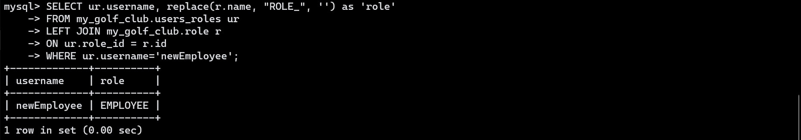
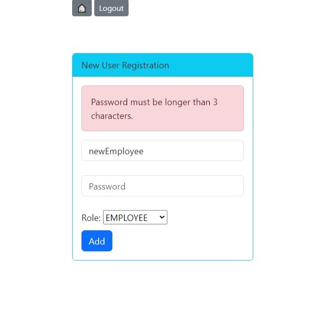

# MyGolfClub

MyGolfClub is an implementation of a web-based management system.
Users must log in using **unique** username and respected password to **authenticate**.
All passwords are **encrypted** using **bcrypt** and stored securely in a database.
Each user is associated with a given role: _EMPLOYEE_, _MODERATOR_ or _ADMIN_.
The role defines **authorization** level.

- _EMPLOYEE_ can only view members of the golf club. (`READ` operation)
- _MODERATOR_ can view members and also add a new member to the club. (`CREATE`, `READ` operations)
- _ADMIN_ can view, add, modify and remove a member of the club (Full `CRUD` support)
  <br> They are also authorized to add a new user.

Interaction with a system is done via web app and also extensively with `RESTful API`
after valid **authentication** and **authorization**.
Read further for more details.

# Table Of Content

- [Features](#features)
- [Project Details](#project-details)
- [TODO List](#todo-list)
- [Run Project From Source](#run-project-from-source)
- [Screenshots](#screenshots)
- [API Reference](#api-reference)

# Features

- System management for your golf club - helping you with members' management
- Secured with user authentication and authorization
- Web-based UI
- RESTful API for extensibility
- CRUD operations support
- Included SQL scripts for creation of user, database, tables and records

<div align='right'>
    <a href="#table-of-content">Go back to the Table Of Content</a>
</div>

# Project Details

- Java 17 (LTS)
- MySQL DB 8
- Gradle 8 Kotlin DSL
- Spring Boot 3.2.1
- BootStrap 5.3.2

|            Dependencies             |    Version    |
|:-----------------------------------:|:-------------:|
|      Spring Boot Starter Test       |     3.2.1     | 
|    Spring Boot Starter Data JPA     |     3.2.1     | 
|       Spring Boot Starter Web       |     3.2.1     | 
|     Spring Boot Starter HATEOAS     |     3.2.1     | 
|    Spring Boot Starter Security     |     3.2.1     | 
|    Spring Boot Starter Thymeleaf    |     3.2.1     | 
|  Thymeleaf Extras Spring Security6  | 3.1.2.RELEASE | 
|   Spring Boot Starter Validation    |     3.2.1     | 
| SpringDoc OpenAPI Starter WebMVC UI |     2.3.0     |  
|          MySQL Connector/J          |     8.2.0     | 
|               Lombok                |    1.18.30    |

<div align='right'>
    <a href="#table-of-content">Go back to the Table Of Content</a>
</div>

# TODO List

1. [ ] Unit tests for:

   - [ ] Repository layer:
     * [x] ~~GolfClubMemberRepository~~
     * [ ] RoleDAO
     * [ ] UserDAO
   - [ ] Service layer:
     * [x] ~~GolfClubMemberService~~ 
     * [ ] RoleService 
     * [ ] UserService 
   - [ ] Controller layer:
     * [ ] GolfClubMemberController 
     * [ ] AccessController
     * [ ] MyGolfClubController
     * [ ] UserController


2. [ ] Integration tests

<div align='right'>
    <a href="#table-of-content">Go back to the Table Of Content</a>
</div>

# Run Project From Source

Prerequisites:
MySQL Server 8+, Git, JDK 17+, Gradle 8.3+.

Recommendations: MySQL Workbench 8 or other GUI database manager.

## Database Setup

1. Make sure you run MySQL Server in the background.

2. Connect as root to MySQL Connection of your choice. (the best if you create a new one for this purpose)

3. You will need to run a few SQL scripts. You can find those in [here](./src/main/resources/database/sql-scripts).

4. Create a new user:

- [01-create-user.sql](./database/sql-scripts/01-create-user.sql)

```textmate
    DROP USER if exists 'golfadmin'@'%';
    
    CREATE USER 'golfadmin'@'%' IDENTIFIED BY 'golfadmin';
    
    GRANT ALL PRIVILEGES ON * . * TO 'golfadmin'@'%';
```

5. Create a new connection with **golfadmin** user.

6. Create a database schema:

- [02-create-db-schema.sql](./database/sql-scripts/02-create-db-schema.sql)

```textmate
    CREATE DATABASE  IF NOT EXISTS `my_golf_club`;
    USE `my_golf_club`;
```

7. Create tables and insert records:

- [03-create-golf-club-member-table.sql](./database/sql-scripts/03-create-golf-club-member-table.sql)

```textmate
    DROP TABLE IF EXISTS `golf_club_member`;
    
    CREATE TABLE `golf_club_member` (
      `id` int NOT NULL AUTO_INCREMENT,
      `first_name` varchar(45) NOT NULL,
      `last_name` varchar(45) NOT NULL,
      `email` varchar(45) NOT NULL,
      `active_member` boolean DEFAULT FALSE NOT NULL,
      PRIMARY KEY (`id`)
    ) ENGINE=InnoDB AUTO_INCREMENT=1 DEFAULT CHARSET=latin1;
    
    INSERT INTO `golf_club_member` VALUES 
        (1,'Emma','Green','emmagreen@mail.com',true),
        (2,'Anna','Barsky','annab@mail.de',false),
        (3,'Richard','Dunkins','rdunkins@mail.com',true),
        (4,'Thomas','Terra','thomas@terra.me',true),
        (5,'Edwin','Vega','edwin.vega@maily.com',false);
```

- [04-create-users-and-authorities-tables.sql](./database/sql-scripts/04-create-users-and-authorities-tables.sql)

```textmate
    USE `my_golf_club`;
    
    SET FOREIGN_KEY_CHECKS = 0;
    DROP TABLE IF EXISTS `users_roles`;
    DROP TABLE IF EXISTS `role`;
    DROP TABLE IF EXISTS `user`;
    SET FOREIGN_KEY_CHECKS = 1;
    
    CREATE TABLE `user` (
      `username` varchar(50) NOT NULL UNIQUE,
      `password` char(60) NOT NULL,
      `enabled` tinyint NOT NULL,
      PRIMARY KEY (`username`)
    ) ENGINE=InnoDB DEFAULT CHARSET=latin1;
    
    INSERT INTO `user` VALUES
        ('employee','$2a$12$mjbSTPLi/cLOxxdrFrwcKO5kwpkiRAiB85Hs39Pbj4bA9nfD/ZtFy',1),
        ('moderator','$2a$12$wd.0xHxzTtkZAEKFLM3/2eoXzkNcbcTZXEONdyy.udVvKyxXy.0La',1),
        ('admin','$2a$12$jGXj8Ve3VwaVrnfwYeB7HOHzPZa9dMPT.WT7cPWT.04o/x0HAplk2',1);
    
    CREATE TABLE `role` (
        `id` int(11) NOT NULL AUTO_INCREMENT,
        `name` varchar(50) NOT NULL,
        PRIMARY KEY(`id`)
    ) ENGINE=InnoDB AUTO_INCREMENT=1 DEFAULT CHARSET=latin1;
    
    INSERT INTO `role` (`name`) VALUES
        ('ROLE_EMPLOYEE'),
        ('ROLE_MODERATOR'),
        ('ROLE_ADMIN');
    
    SET FOREIGN_KEY_CHECKS = 0;
    
    CREATE TABLE `users_roles` (
      `username` varchar(50) NOT NULL,
      `role_id` int(11) NOT NULL,
      PRIMARY KEY (`username`, `role_id`),
      KEY `FK_ROLE_idx` (`role_id`),
    
      CONSTRAINT `FK_USER` FOREIGN KEY (`username`)
      REFERENCES `user` (`username`)
      ON DELETE NO ACTION ON UPDATE NO ACTION,
    
      CONSTRAINT `FK_ROLE` FOREIGN KEY (`role_id`)
      REFERENCES `role` (`id`)
      ON DELETE NO ACTION ON UPDATE NO ACTION
    ) ENGINE=InnoDB DEFAULT CHARSET=latin1;
    
    SET FOREIGN_KEY_CHECKS = 1;
    
    INSERT INTO `users_roles` VALUES
        ('employee', 1),
        ('moderator', 1),
        ('moderator', 2),
        ('admin', 1),
        ('admin', 2),
        ('admin', 3);
```

## Project Setup

1. Open a terminal in your desired location.

- (Optional) Define a parent directory for a project.

Linux, macOS:

```shell
  mkdir parent-dir && cd "$_"
```

Windows/Powershell:

```shell
  ($dir = "parent-dir") -and (mkdir $dir) -and (cd $dir)
```

> You can use the name of your choice instead.

2. Clone repository:

```shell
  git clone https://github.com/lucasmalara/my-golf-club.git
```

- or using GitHub CLI:

```shell
  gh repo clone lucasmalara/my-golf-club
```

3. Open the main directory of a project

```shell
  cd my-golf-club
```

> The Name of this directory is inherited from this repository name.

4. Run with Gradle:

```shell
  gradle bootRun
```

- or if your environment variable `JAVA_HOME` uses jdk lower than 17, 
or you do not have it, then you should add: `-D org.gradle.java.home='$JDK_PATH'`,
where `$JDK_PATH` is an absolute path to a root folder of jdk 17 or 17+.

```shell
  gradle bootRun -D org.gradle.java.home='$JDK_PATH'
```

<div align='right'>
    <a href="#table-of-content">Go back to the Table Of Content</a>
</div>

# Screenshots

The following cases have to be followed:

1. [Unauthenticated](#1-unauthenticated)

   - [Login Page](#login-page)
   - [Login Page if you provide invalid credentials](#login-page-if-you-provide-invalid-credentials)


2. [Authenticated with Employee role](#2-employee-role)

   - [Home Page](#employee---home-page)
   - [List Of Members](#employee---list-of-members)
   - [List of Active Members](#employee---list-of-active-members)
   - [Add Member](#employee---add-member)
   - [Update Member](#employee---update-member)
   - [Delete Member](#employee---delete-member)
   - [Add User](#employee---add-user)


3. [Authenticated with Moderator role](#3-moderator-role)

   - [Home Page](#moderator---home-page)
   - [List Of Members](#moderator---list-of-members)
   - [List of Active Members](#moderator---list-of-active-members)
   - [Add Member](#moderator---add-member)
     * [Form](#moderator---add-member-form)
     * [Success](#moderator---add-member-success)
     * [Invalid Data Provided](#moderator---add-member-invalid-data-provided)
       + [First name](#moderator---add-member-first-name-invalid)
       + [Last name](#moderator---add-member-last-name-invalid)
       + [Email](#moderator---add-member-email-invalid)
   - [Update Member](#moderator---update-member)
   - [Delete Member](#moderator---delete-member)
   - [Add User](#moderator---add-user)


4. [Authenticated with Admin role](#4-admin-role)

   - [Home Page](#admin---home-page)
   - [List Of Members](#admin---list-of-members)
   - [List of Active Members](#admin---list-of-active-members)
   - [Add Member](#admin---add-member)
     * [Form](#admin---add-member-form)
     * [Success](#admin---add-member-success)
     * [Invalid Data Provided](#admin---add-member-invalid-data-provided)
       + [First name](#admin---add-member-first-name-invalid)
       + [Last name](#admin---add-member-last-name-invalid)
       + [Email](#admin---add-member-email-invalid)
   - [Update Member](#admin---update-member)
     * [Form](#admin---update-member-form)
     * [Success](#admin---update-member-success)
     * [Invalid Data Provided](#admin---update-member-invalid-data-provided)
       + [First name](#admin---update-member-first-name-invalid)
       + [Last name](#admin---update-member-last-name-invalid)
       + [Email](#admin---update-member-email-invalid)
   - [Delete Member](#admin---delete-member)
   - [Add User](#admin---add-user)
     * [Form](#admin---add-user-form)
     * [Success](#admin---add-user-success)
     * [Invalid Data Provided](#admin---add-user-invalid-data-provided)
       + [Username and password](#admin---add-user-username-and-password-invalid)
       + [Username](#admin---add-user-username-invalid)
       + [Password](#admin---add-user-password-invalid)


5. [Any authenticated](#5-any-authenticated)

   - [Invalid URL Provided](#invalid-url-address)
   - [Logout success](#logout-successfully)


> If you do not authenticate, you will be redirected to a login page.

<br>

## 1. Unauthenticated

### Login Page

`/login`


<div align='right'>
    <a href="#screenshots">Go back to the screenshots cases</a>
</div>

<br>

### Login Page if you provide invalid credentials

`/login?error`


<div align='right'>
    <a href="#screenshots">Go back to the screenshots cases</a>
</div>

<br>

## 2. Employee Role

### Employee - Home Page

`/my-golf-club`


<div align='right'>
    <a href="#screenshots">Go back to the screenshots cases</a>
</div>

<br>

### Employee - List Of Members

`/my-golf-club/members/list`


<div align='right'>
    <a href="#screenshots">Go back to the screenshots cases</a>
</div>

<br>

### Employee - List of Active Members

`/my-golf-club/members/list/active`


<div align='right'>
    <a href="#screenshots">Go back to the screenshots cases</a>
</div>

<br>

### Employee - Add Member

`/my-golf-club/members/add`


<div align='right'>
    <a href="#screenshots">Go back to the screenshots cases</a>
</div>

<br>

### Employee - Update Member

`/my-golf-club/members/update?memberId=1`


<div align='right'>
    <a href="#screenshots">Go back to the screenshots cases</a>
</div>

<br>

### Employee - Delete Member

`/my-golf-club/members/delete?memberId=1`


<div align='right'>
    <a href="#screenshots">Go back to the screenshots cases</a>
</div>

<br>

### Employee - Add User

`/my-golf-club/users/add`


<div align='right'>
    <a href="#screenshots">Go back to the screenshots cases</a>
</div>

<br>

## 3. Moderator Role

### Moderator - Home Page

`/my-golf-club`


<div align='right'>
    <a href="#screenshots">Go back to the screenshots cases</a>
</div>

<br>

### Moderator - List Of Members

`/my-golf-club/members/list`


<div align='right'>
    <a href="#screenshots">Go back to the screenshots cases</a>
</div>

<br>

### Moderator - List Of Active Members

`/my-golf-club/members/list/active`


<div align='right'>
    <a href="#screenshots">Go back to the screenshots cases</a>
</div>

<br>

### Moderator - Add Member

#### Moderator - Add Member Form

`/my-golf-club/members/add`


<div align='right'>
    <a href="#screenshots">Go back to the screenshots cases</a>
</div>

<br>

#### Moderator - Add Member Success


`/my-golf-club/members/list`


`/my-golf-club/members/list/active`


<div align='right'>
    <a href="#screenshots">Go back to the screenshots cases</a>
</div>

<br>

#### Moderator - Add Member Invalid Data Provided

`/my-golf-club/members/save`

#### Moderator - Add Member First Name Invalid


<div align='right'>
    <a href="#screenshots">Go back to the screenshots cases</a>
</div>

<br>

#### Moderator - Add Member Last Name Invalid


<div align='right'>
    <a href="#screenshots">Go back to the screenshots cases</a>
</div>

<br>

#### Moderator - Add Member Email Invalid


<div align='right'>
    <a href="#screenshots">Go back to the screenshots cases</a>
</div>

<br>

### Moderator - Update Member

`/my-golf-club/members/update?memberId=1`


<div align='right'>
    <a href="#screenshots">Go back to the screenshots cases</a>
</div>

<br>

### Moderator - Delete Member

`/my-golf-club/members/delete?memberId=1`


<div align='right'>
    <a href="#screenshots">Go back to the screenshots cases</a>
</div>

<br>

### Moderator - Add User

`/my-golf-club/users/add`


<div align='right'>
    <a href="#screenshots">Go back to the screenshots cases</a>
</div>

<br>

## 4. Admin Role

### Admin - Home Page

`/my-golf-club`


<div align='right'>
    <a href="#screenshots">Go back to the screenshots cases</a>
</div>

<br>

### Admin - List Of Members

`/my-golf-club/members/list`


<div align='right'>
    <a href="#screenshots">Go back to the screenshots cases</a>
</div>

<br>

### Admin - List Of Active Members

`/my-golf-club/members/list/active`


<div align='right'>
    <a href="#screenshots">Go back to the screenshots cases</a>
</div>

<br>

### Admin - Add Member

#### Admin - Add Member Form

`/my-golf-club/members/add`


<div align='right'>
    <a href="#screenshots">Go back to the screenshots cases</a>
</div>

<br>

#### Admin - Add Member Success


`/my-golf-club/members/list`


`/my-golf-club/members/list/active`


<div align='right'>
    <a href="#screenshots">Go back to the screenshots cases</a>
</div>

<br>

#### Admin - Add Member Invalid Data Provided

`/my-golf-club/members/save`

#### Admin - Add Member First Name Invalid


<div align='right'>
    <a href="#screenshots">Go back to the screenshots cases</a>
</div>

<br>

#### Admin - Add Member Last Name Invalid


<div align='right'>
    <a href="#screenshots">Go back to the screenshots cases</a>
</div>

<br>

#### Admin - Add Member Email Invalid


<div align='right'>
    <a href="#screenshots">Go back to the screenshots cases</a>
</div>

<br>

### Admin - Update Member

`/my-golf-club/members/list`


#### Admin - Update Member Form

`/my-golf-club/members/update?memberId=6`


<div align='right'>
    <a href="#screenshots">Go back to the screenshots cases</a>
</div>

<br>

#### Admin - Update Member Success


`/my-golf-club/members/list`


`/my-golf-club/members/list/active`


<div align='right'>
    <a href="#screenshots">Go back to the screenshots cases</a>
</div>

#### Admin - Update Member Invalid Data Provided

`/my-golf-club/members/save`

#### Admin - Update Member First Name Invalid


<div align='right'>
    <a href="#screenshots">Go back to the screenshots cases</a>
</div>

<br>

#### Admin - Update Member Last Name Invalid


<div align='right'>
    <a href="#screenshots">Go back to the screenshots cases</a>
</div>

<br>

#### Admin - Update Member Email Invalid


<div align='right'>
    <a href="#screenshots">Go back to the screenshots cases</a>
</div>

<br>

### Admin - Delete Member

`/my-golf-club/members/delete?memberId=6`


`/my-golf-club/members/list`


`/my-golf-club/members/list/active`


<div align='right'>
    <a href="#screenshots">Go back to the screenshots cases</a>
</div>

<br>

### Admin - Add User

#### Admin - Add User Form

`/my-golf-club/users/add`


<div align='right'>
    <a href="#screenshots">Go back to the screenshots cases</a>
</div>

<br>

#### Admin - Add User Success

`/my-golf-club/users/save`


**We can verify if a user has been added.**

1. Open `MySQL Command Line Client`

2. You will be asked for a password to your `root` **MySQL** account. Provide correct password and press `enter`.

3. Connect to database `my_golf_club`

```shell
    use my_golf_club
```

4. List all users

```textmate
    SELECT * FROM user;
```


We can also list users via GUI application:


> As we can see, all passwords are encrypted.

<br>

**Now, we verify if user has declared role(s)**

5. List user with his role(s)

```textmate
    SELECT ur.username, replace(r.name,"ROLE_", '') as 'role'
    FROM my_golf_club.users_roles ur
    LEFT JOIN my_golf_club.role r
    ON ur.role_id = r.id
    WHERE ur.username=$username;
```

in this case `$username = 'newEmployee'`




<div align='right'>
    <a href="#screenshots">Go back to the screenshots cases</a>
</div>

<br>

#### Admin - Add User Invalid Data Provided

`/my-golf-club/members/save`

#### Admin - Add User Username And Password Invalid


<div align='right'>
    <a href="#screenshots">Go back to the screenshots cases</a>
</div>

<br>

#### Admin - Add User Username Invalid


<div align='right'>
    <a href="#screenshots">Go back to the screenshots cases</a>
</div>

<br>

#### Admin - Add User Password Invalid




<div align='right'>
    <a href="#screenshots">Go back to the screenshots cases</a>
</div>

<br>

## 5. Any Authenticated

### Invalid URL Address

e.g.: `/my-golf-club/custom`


<div align='right'>
    <a href="#screenshots">Go back to the screenshots cases</a>
</div>

<br>

### Logout Successfully

`/login?logout`


<div align='right'>
    <a href="#table-of-content">Go back to the Table Of Content</a>
</div>

# API Reference

To read **official documentation**, run the project, authenticate and go to address:
http://localhost:9090/swagger-ui/index.html

You can also click on a proper button on the homepage, the page you are redirected to after successful authentication. &darr;


> Make sure you have 9090 port available, since configuration specifies to run on this server port.
You could also change the configuration to your liking if necessary.

## Supported HTTP methods and endpoints:

Default `HOST` = http://localhost:9090

|               GET               | Key (optional) | Value (if key is included) |
|:-------------------------------:|:--------------:|:--------------------------:|
| `HOST/my-golf-club/api/members` |    _active_    |         `boolean`          |

<br>

|                   GET                   | Path variable (required) |
|:---------------------------------------:|:------------------------:|
|  `HOST/my-golf-club/api/members/{int}`  |       int {1, ..}        |

<br>

|               POST                |                   Request body (required)                    |
|:---------------------------------:|:------------------------------------------------------------:|
|  `HOST/my-golf-club/api/members`  | `application/json` see example in **official documentation** |

<br>

|                  PUT                  | Path variable (required) |                   Request body (required)                    |
|:-------------------------------------:|:------------------------:|:------------------------------------------------------------:|
| `HOST/my-golf-club/api/members/{int}` |       int {1, ..}        | `application/json` see example in **official documentation** |

<br>

|                DELETE                 | Path variable (required) |
|:-------------------------------------:|:------------------------:|
| `HOST/my-golf-club/api/members/{int}` |       int {1, ..}        |

<div align='right'>
    <a href="#table-of-content">Go back to the Table Of Content</a>
</div>

# Author

[@lucasmalara](https://github.com/lucasmalara "author")
